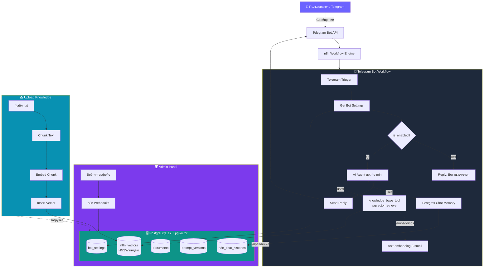

# 🤖 Telegram AI-ассистент для «Центр Красок №1»

> RAG-чат-бот для сети магазинов лакокрасочной продукции в Казахстане  
> Отвечает на вопросы клиентов о компании, услугах, ценах и брендах на основе базы знаний.

---

## 📌 О проекте

Telegram-бот с AI-ассистентом, работающий в формате обычного чата (без команд и меню). Пользователь пишет вопрос на естественном языке — бот отвечает на основе собранной информации о компании.

**Бот:** [@samruk_test_bot](https://t.me/samruk_test_bot)  
**Админ-панель:** `https://n8n.diku.kz/webhook/admin`  
**Компания:** [centr-krasok.kz](https://centr-krasok.kz)

---

## ✨ Возможности

- 🗣️ **Естественный диалог** — без команд, бот понимает свободные вопросы
- 🌍 **3 языка** — отвечает на языке вопроса (русский / казахский / английский)
- 🧠 **RAG-поиск** — использует векторную базу знаний, не «галлюцинирует»
- 💾 **Память диалога** — помнит контекст последних 10 сообщений
- 🎛️ **Веб-админка** — управление ботом, базой знаний и промптом через браузер
- 📜 **Версионирование промптов** — сохраняет историю с возможностью отката
- 🔒 **Защита админки** паролем
- ⏯️ **Тумблер бота** — можно мгновенно включить/выключить ответы

---

## 🏗️ Архитектура



---

## 🛠️ Технологический стек

| Слой | Технология |
|---|---|
| **AI / LLM** | OpenAI GPT-4o-mini (temperature 0.3) |
| **Embeddings** | OpenAI text-embedding-3-small (1536 dim) |
| **Векторная БД** | PostgreSQL 17 + pgvector 0.8 (HNSW индекс) |
| **Оркестрация** | n8n (self-hosted, Docker) |
| **Memory** | Postgres Chat Memory (10 последних сообщений) |
| **Messenger** | Telegram Bot API |
| **Backend админки** | n8n Webhooks |
| **Frontend админки** | HTML + Vanilla JS, шрифт Geologica |
| **Сервер** | Ubuntu 24, домен n8n.diku.kz |

---

## 📊 Структура базы данных

База: `client_dashboard_db` на PostgreSQL 17 с расширением pgvector.

### Таблицы

| Таблица | Назначение | Ключевые поля |
|---|---|---|
| `n8n_vectors` | Векторная база знаний (RAG) | `id` UUID, `text`, `metadata` JSONB, `embedding` vector(1536), `document_id` |
| `documents` | Метаданные загруженных файлов | `id`, `filename`, `file_type`, `chunks_count`, `uploaded_at` |
| `bot_settings` | Настройки бота | `id`, `is_enabled`, `system_prompt`, `updated_at` |
| `prompt_versions` | История версий промпта | `id`, `system_prompt`, `created_at`, `note` |
| `n8n_chat_histories` | Память диалогов | `id`, `session_id`, `message` JSONB |

### Индексы

- **HNSW** на `n8n_vectors.embedding` — для быстрого векторного поиска cosine similarity
- **UNIQUE** на `documents.filename` — защита от дубликатов
- **B-tree** на `n8n_chat_histories.session_id` — для быстрой выборки контекста

---

## 🔧 Как это работает

### 1. Сбор информации о компании

Информация собрана с официального сайта [centr-krasok.kz](https://centr-krasok.kz) и соцсетей:
- Описание компании, юридические реквизиты
- Каталог из 40+ брендов
- Услуги (колеровка 45 000 оттенков, доставка в 23 города)
- Цены на популярные позиции
- График работы, контакты, способы оплаты
- FAQ

Структурирована в 13 разделов и сохранена в виде .txt-документа базы знаний.

### 2. Загрузка в векторную БД (RAG ingestion)

```
Текст → Chunk (800 символов, overlap 80) → OpenAI Embedding → pgvector
```

- Текст режется на чанки по ~800 символов со «смарт-разрезом» по точкам/пробелам
- Защита от циклов: max 50 чанков
- Каждый чанк превращается в вектор 1536 чисел (text-embedding-3-small)
- Сохраняется в `n8n_vectors` с привязкой к `document_id`

### 3. Поиск и ответ (RAG query)

```
Вопрос пользователя → Embedding → Cosine similarity search (top 7) → Контекст для LLM → Ответ
```

- Сообщение пользователя проходит через AI Agent
- Agent вызывает инструмент `knowledge_base_tool` (PGVector retrieve-as-tool)
- Возвращает 7 самых релевантных чанков из БЗ
- GPT-4o-mini отвечает строго на основе найденных документов

### 4. Защита от галлюцинаций

В системном промпте:
- Обязательное использование `knowledge_base_tool` для каждого вопроса
- Запрет придумывать факты
- Если ответа нет в базе → выдаёт контакты для связи
- temperature: 0.3 (низкая, для фактов)

---

## 🎛️ Админ-панель

Веб-интерфейс по адресу `/webhook/admin` с паролем.

### Разделы

**🏠 Главная** — статистика:
- Количество документов в БЗ
- Количество векторных чанков
- Количество сообщений в истории чатов
- Статус бота (ON/OFF)

**📁 База знаний** — управление документами:
- Drag & drop загрузка файлов (.txt, .pdf, .docx до 10 МБ)
- Автоматическая обработка: разбиение → эмбеддинги → запись в БД
- Удаление документов (каскадно удаляет связанные чанки)

**⭐ Промпт** — редактирование системного промпта:
- Полнотекстовый редактор
- Автосохранение версий
- История последних 10 версий с возможностью отката

**⏯️ Тумблер бота** — мгновенное включение/выключение ответов

---

## 📨 Примеры вопросов и ответов

| Вопрос | Что делает бот |
|---|---|
| «Чем занимается компания?» | Находит чанк раздела «О компании» → отвечает |
| «Сколько стоит Dulux BINDO 7 9 литров?» | Находит чанк с ценами → «56 250 тенге» |
| «Где офис?» | Находит контакты → «г. Алматы, ул. Кабдолова 1/8» |
| «Делаете доставку в Шымкент?» | Находит список городов → «Да, доставляем» |
| «Қазақша сөйлей аласың ба?» | Переключается на казахский |
| «Расскажи анекдот» | Возвращает к теме компании |
| «А Dulux это что?» (после предыдущего вопроса) | Использует контекст диалога |

---

## 🚀 Установка и запуск

### Требования

- Ubuntu 22.04+ (или другой Linux)
- Docker + Docker Compose
- PostgreSQL 17 с pgvector
- Telegram Bot token (через @BotFather)
- OpenAI API key

### Шаг 1. База данных

```sql
CREATE EXTENSION IF NOT EXISTS vector;

CREATE TABLE n8n_vectors (
    id UUID PRIMARY KEY DEFAULT gen_random_uuid(),
    text TEXT,
    metadata JSONB,
    embedding vector(1536),
    document_id INTEGER
);

CREATE TABLE documents (
    id SERIAL PRIMARY KEY,
    filename TEXT UNIQUE NOT NULL,
    file_type TEXT,
    chunks_count INTEGER DEFAULT 0,
    uploaded_at TIMESTAMP DEFAULT now()
);

CREATE TABLE bot_settings (
    id SERIAL PRIMARY KEY,
    is_enabled BOOLEAN DEFAULT true,
    system_prompt TEXT NOT NULL,
    updated_at TIMESTAMP DEFAULT now()
);

CREATE TABLE prompt_versions (
    id SERIAL PRIMARY KEY,
    system_prompt TEXT NOT NULL,
    created_at TIMESTAMP DEFAULT now(),
    note TEXT
);

CREATE INDEX ON n8n_vectors USING hnsw (embedding vector_cosine_ops);
```

### Шаг 2. n8n

Запустить self-hosted n8n в Docker. Импортировать workflows:
1. `1_telegram_bot.json` — основной бот (активировать)
2. `2_upload_knowledge.json` — загрузка БЗ (manual trigger)
3. `3_admin_panel.json` — веб-админка (активировать)

### Шаг 3. Настройка credentials в n8n

- **Postgres** — подключение к БД
- **OpenAI** — API key с доступом к gpt-4o-mini и embeddings
- **Telegram** — Bot Token

### Шаг 4. Загрузка базы знаний

- Открыть workflow `2. Upload Knowledge`
- Нажать **Execute workflow**
- Проверить что в `n8n_vectors` появилось ~10-15 чанков

### Шаг 5. Тест

Написать боту в Telegram любой вопрос про компанию. Должен ответить из базы.

---

## 🎯 Соответствие техническому заданию

| Требование | Реализация |
|---|---|
| ✅ Собрать инфу о компании | 13 разделов с сайта + соцсети |
| ✅ Структурировать | Markdown-документ |
| ✅ Очистить от лишнего | Только полезная инфа |
| ✅ Подготовить для AI | Chunking + embeddings |
| ✅ Бот без команд | Обычный чат через Telegram |
| ✅ AI-чат | GPT-4o-mini + RAG |
| ✅ Ответы связаны с компанией | System prompt + RAG ограничивают тему |
| ✅ AI отвечает на основе собранной инфы | pgvector retrieve-as-tool, topK=7 |
| ✅ Ограничить галлюцинации | Низкая temperature + промпт-инструкции |
| ✅ UX бота | Естественный диалог, без эмодзи, 2-5 предложений |
| ✅ Контекст диалога | Postgres Chat Memory, 10 последних сообщений |
| ✅ Защита от некорректных ответов | Fallback на контакты компании |

---

## 💡 Что сделано сверх ТЗ

- 🎛️ **Полноценная веб-админка** для управления ботом без правки кода
- 📜 **Версионирование промптов** с откатом на любую версию
- 🌍 **Мультиязычность** (русский / казахский / английский)
- 📤 **Drag & drop загрузка** документов через UI
- 🔐 **Защита админки паролем**
- 📊 **Дашборд статистики** в реальном времени
- 🗄️ **Self-hosted архитектура** (своя БД, свой n8n) — не зависим от SaaS
- 🚀 **Production-ready RAG** с HNSW-индексом для быстрого поиска

---

## 📁 Состав репозитория

```
/
├── README.md                           ← этот файл
├── workflows/
│   ├── 1_telegram_bot.json            ← основной бот
│   ├── 2_upload_knowledge.json        ← загрузка базы знаний
│   └── 3_admin_panel.json             ← веб-админка
├── knowledge_base/
│   └── Centr_Krasok_Knowledge_Base.txt ← исходный текст БЗ
└── sql/
    └── schema.sql                      ← структура БД
```

---

## 👤 Автор

**Saltanat** — самостоятельная разработка MVP  
Алматы / Астана, Казахстан

---

## 📄 Лицензия

MIT
